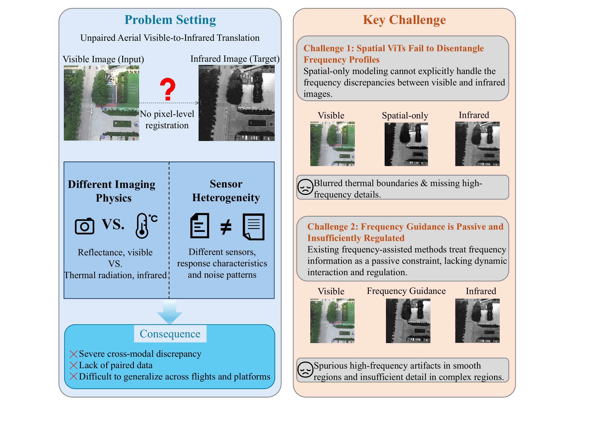
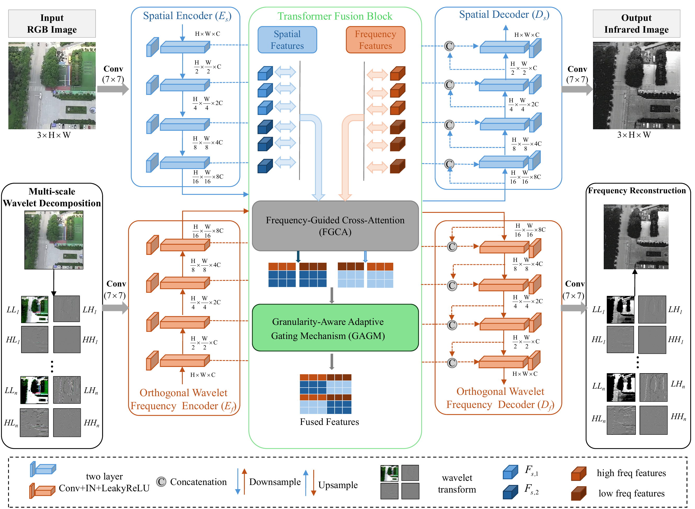
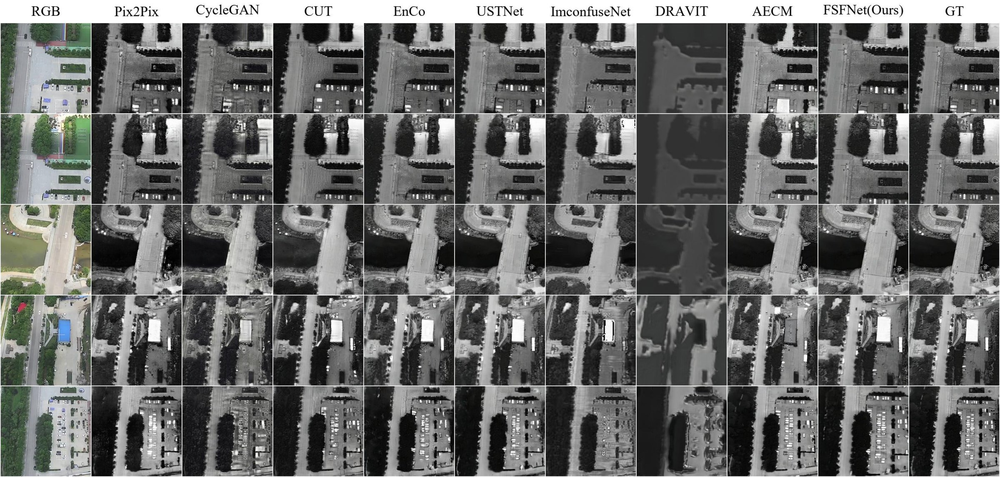
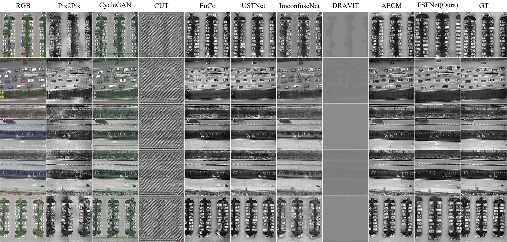
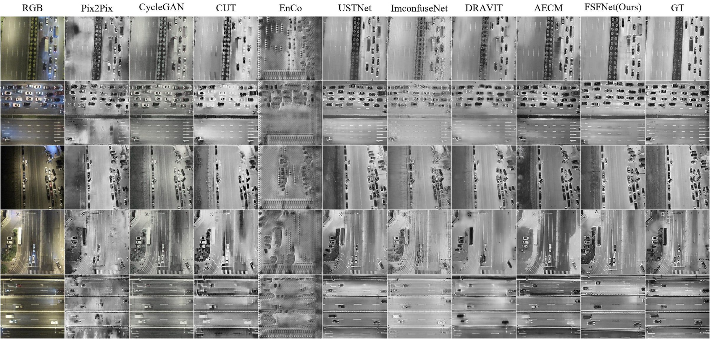

<div align="center">

# Frequency-Guided Spatial-Frequency Collaborative Network for Unregistered Aerial Visible-to-Infrared Image Translation

**Li Ying, Zhikun Li, Zhifei Zhang, Member, IEEE, Yizhang Liu, and Mingjian Guang, Member, IEEE**

Submitted to *IEEE Journal of Selected Topics in Applied Earth Observations and Remote Sensing (JSTARS)* · Under Review

*Corresponding author: Zhifei Zhang.*

**Core architecture code has been pre-released in this repository.**

**Project page: <https://risinginsightmore.github.io/FSFNet/>**

[-red)]()
[]()
[]()
[](https://risinginsightmore.github.io/FSFNet/)
[](https://github.com/RisingInsightMore/FSFNet)

</div>

---

## Abstract

Aerial visible-to-infrared image translation generates infrared imagery from visible inputs, expanding infrared data acquisition in complex aerial scenarios. Although existing approaches built on convolutional neural networks or vision transformers capture local details and global scene context, they lack explicit modeling of multiscale frequency semantics and rely on implicitly gated fusion that fails to characterize local structural complexity, leading to distorted energy distributions, structural blurring, and spurious high-frequency artifacts in homogeneous regions.

To address these challenges, a frequency-guided spatial-frequency collaborative network (**FSFNet**) is proposed to explicitly decouple multiscale spectral structures while preserving spatial topological details via a dual-path encoder-decoder framework. An orthogonal wavelet frequency encoder and a frequency-guided cross-attention mechanism are introduced, in which the decoupled low- and high-frequency representations serve as queries for spatial context retrieval under a layer-wise dynamic dual-stream window exchange. A granularity-aware adaptive gating mechanism is further designed to quantify local structural roughness through parameter-free statistics and progressively modulate channel- and position-wise fusion according to regional complexity, while a pluggable auxiliary frequency decoder preserves target-domain spectral structure during training at zero additional inference cost.

Experiments on three aerial benchmarks show that our FSFNet ranks first in **11 of 18** evaluation cases and among the top two in **16**, achieving the best LPIPS and SSIM on all three datasets. On AVIID-3, FSFNet reduces the FID by **11.5%** and improves the PSNR by **0.65 dB** over a purely spatial baseline while sustaining **27.7 FPS**.

**Keywords:** Aerial visible-to-infrared image translation, frequency-guided cross-attention, granularity-aware adaptive gating, multiscale frequency semantics.

---

## Contributions

<div align="center">



*Overview of the unpaired aerial visible-to-infrared translation problem and the two key challenges motivating this work.*

</div>

1. **A spatial-frequency dual-path collaborative generation architecture.** We build an independent frequency encoding branch based on the 2D discrete wavelet transform (DWT) to explicitly isolate low-frequency structural responses from high-frequency detail components. Operating in parallel with a multiscale spatial encoder, this branch provides complementary spatial frequency representations and explicit frequency guidance for unpaired visible-to-infrared translation.

2. **Frequency-guided cross-attention (FGCA).** Departing from the conventional homogeneous self-attention, FGCA uses decoupled frequency representations (both low and high frequency) as queries to actively sample spatial contextual features. Combined with an alternating dual-stream window strategy, it enables frequency-prior-guided spatial feature interaction and multiscale structural fusion.

3. **Granularity-aware adaptive gating mechanism (GAGM).** Inspired by granular computing, GAGM explicitly quantifies the structural complexity of spatial information granules through nonparametric local statistics to construct a spatial granularity map. Coupled with a progressive training scheduler, it dynamically modulates channel- and position-wise gating, enabling region-adaptive fusion of low-frequency structural information and high-frequency detail representations.

4. **Training-only frequency reconstruction.** A pluggable auxiliary frequency decoder enforces frequency-domain reconstruction constraints during training to consolidate target domain spectral consistency. This auxiliary branch is discarded during inference, achieving high-fidelity cross-modal translation without incurring additional computational overhead.

---

## Method

<div align="center">



*Overall architecture of the proposed FSFNet. The spatial structure encoder E<sub>s</sub> and the discrete wavelet frequency encoder E<sub>f</sub> extract complementary representations in parallel.*

</div>

FSFNet is a dual-path encoder-decoder framework that explicitly decouples multiscale frequency representations from spatial topological structure. A spatial structure encoder and a discrete wavelet frequency encoder operate in parallel; the decoupled low- and high-frequency representations then serve as queries in a frequency-guided cross-attention (FGCA) module that retrieves spatial context under a layer-wise dynamic dual-stream window exchange; and a granularity-aware adaptive gating mechanism (GAGM) quantifies local structural roughness through parameter-free statistics to modulate channel- and position-wise fusion according to regional complexity. During training, a pluggable auxiliary frequency decoder enforces frequency-domain reconstruction; it is discarded at inference, adding zero additional cost.

---

## Results

### Benchmark Datasets

| Dataset | Illumination | Total Pairs | Train / Test | Resolution (pixels) |
|---|---|--:|--:|:-:|
| AVIID-3 | Daytime | 3,216 | 2,412 / 804 | 512 × 512 |
| Day-DroneVehicle | Daytime | 7,660 | 5,745 / 1,915 | 640 × 512 |
| Night-DroneVehicle | Nighttime | 13,140 | 9,855 / 3,285 | 640 × 512 |

### Comparison with State-of-the-Art Methods

> Across three public aerial benchmarks (**18 metric evaluations** in total), FSFNet ranks **first in 11 cases** and within the **top two in 16**, and establishes uninterrupted dominance in **LPIPS and SSIM** across both daytime and nighttime conditions. Best results are in **bold**, second-best are <u>underlined</u>; ↓ (↑) indicates that lower (higher) is better.

#### (a) AVIID-3

| Method | FID↓ | KID↓ | LPIPS↓ | RMSE↓ | SSIM↑ | PSNR↑ |
|---|---|---|---|---|---|---|
| Pix2Pix | 84.24536 | 0.039870 | 0.284519 | 29.989248 | 0.515265 | 18.956686 |
| CycleGAN | 82.14132 | 0.025350 | 0.300864 | 37.436294 | 0.404162 | 16.847453 |
| CUT | 95.33009 | 0.033596 | 0.350033 | 38.927721 | 0.405757 | 16.492552 |
| EnCo | 84.06712 | 0.028891 | 0.241989 | 26.820914 | 0.499146 | 19.731120 |
| DR-AVIT | 214.85513 | 0.145197 | 0.593349 | 70.787318 | 0.302367 | 11.627863 |
| USTNet | 50.87250 | 0.006881 | <u>0.208130</u> | <u>25.571699</u> | <u>0.574911</u> | <u>20.204583</u> |
| ImconfuseNet | 97.62250 | 0.032440 | 0.283797 | 33.005892 | 0.455096 | 17.926994 |
| CycleMamba | 179.79673 | 0.163505 | 0.649781 | 81.332077 | 0.162434 | 9.975021 |
| AECM | **43.26300** | **0.001933** | 0.246329 | 38.473896 | 0.466449 | 16.835820 |
| **FSFNet (Ours)** | <u>45.00005</u> | <u>0.004547</u> | **0.194302** | **23.714777** | **0.584978** | **20.851626** |

#### (b) Day-DroneVehicle

| Method | FID↓ | KID↓ | LPIPS↓ | RMSE↓ | SSIM↑ | PSNR↑ |
|---|---|---|---|---|---|---|
| Pix2Pix | 160.00029 | 0.137296 | 0.313117 | 54.334250 | 0.353191 | 13.638398 |
| CycleGAN | 94.05906 | 0.054729 | 0.342277 | 58.777830 | 0.268798 | 12.877211 |
| CUT | 445.85667 | 0.532393 | 0.684109 | 73.757324 | 0.063644 | 10.802577 |
| EnCo | 83.00264 | 0.048721 | 0.299899 | 55.599082 | 0.376335 | 13.553605 |
| DR-AVIT | 443.69373 | 0.452442 | 0.853234 | 57.026964 | 0.343010 | 13.132876 |
| USTNet | 27.91764 | 0.003475 | <u>0.216254</u> | <u>47.719773</u> | <u>0.486843</u> | <u>14.992926</u> |
| ImconfuseNet | 69.78602 | 0.033836 | 0.302829 | 48.990387 | 0.363916 | 14.577407 |
| CycleMamba | 244.53473 | 0.199789 | 0.741614 | 75.562867 | 0.129687 | 10.700540 |
| AECM | **25.06893** | **0.000781** | 0.232957 | 54.929075 | 0.431469 | 13.689555 |
| **FSFNet (Ours)** | <u>25.16958</u> | <u>0.001737</u> | **0.209149** | **47.153408** | **0.500442** | **15.094191** |

#### (c) Night-DroneVehicle

| Method | FID↓ | KID↓ | LPIPS↓ | RMSE↓ | SSIM↑ | PSNR↑ |
|---|---|---|---|---|---|---|
| Pix2Pix | 83.18299 | 0.072839 | 0.347109 | 50.658449 | 0.358204 | 14.140496 |
| CycleGAN | 50.52592 | 0.030129 | 0.391831 | 55.457723 | 0.304812 | 13.385118 |
| CUT | 79.82762 | 0.062109 | 0.402816 | 56.226394 | 0.329726 | 13.237177 |
| EnCo | 137.48470 | 0.122597 | 0.596731 | 63.097004 | 0.153195 | 12.238241 |
| DR-AVIT | 39.86782 | 0.020800 | 0.342772 | 52.329855 | 0.359702 | 13.856874 |
| USTNet | 18.39930 | <u>0.004124</u> | <u>0.301192</u> | <u>48.862267</u> | <u>0.441370</u> | <u>14.495124</u> |
| ImconfuseNet | 68.15952 | 0.048021 | 0.365475 | **46.865640** | 0.335152 | **14.856630** |
| CycleMamba | 311.45272 | 0.342749 | 0.646167 | 63.269658 | 0.206319 | 12.169338 |
| AECM | **17.61687** | 0.004252 | 0.328866 | 57.859153 | 0.346517 | 13.052859 |
| **FSFNet (Ours)** | <u>17.95355</u> | **0.003609** | **0.298798** | 48.991262 | **0.447708** | 14.485825 |

### Ablation Study

#### (a) AVIID-3

| N | dual-path | freq. loss | GAGM | FID↓ | KID↓ | LPIPS↓ | RMSE↓ | SSIM↑ | PSNR↑ |
|:-:|:-:|:-:|:-:|---|---|---|---|---|---|
| 0 | ✗ | ✗ | ✗ | 50.82725 | 0.006881 | 0.208130 | 25.571699 | 0.574911 | 20.204583 |
| 1 | ✓ | ✗ | ✗ | 46.19873 | 0.005581 | 0.204816 | 25.874743 | 0.573891 | 20.171928 |
| 2 | ✓ | ✓ | ✗ | 45.42301 | 0.005299 | 0.196854 | 24.538258 | 0.582915 | 20.591140 |
| 3 | ✓ | ✓ | ✓ | **45.00005** | **0.004547** | **0.194302** | **23.714777** | **0.584978** | **20.851626** |

#### (b) Day-DroneVehicle

| N | dual-path | freq. loss | GAGM | FID↓ | KID↓ | LPIPS↓ | RMSE↓ | SSIM↑ | PSNR↑ |
|:-:|:-:|:-:|:-:|---|---|---|---|---|---|
| 0 | ✗ | ✗ | ✗ | 27.91764 | 0.003475 | 0.216254 | 47.719773 | 0.486843 | 14.992926 |
| 1 | ✓ | ✗ | ✗ | 25.74340 | 0.002036 | 0.213349 | 48.694017 | 0.493474 | 14.784883 |
| 2 | ✓ | ✓ | ✗ | 27.14012 | 0.002664 | 0.221713 | 49.416147 | 0.487257 | 14.736482 |
| 3 | ✓ | ✓ | ✓ | **25.16958** | **0.001737** | **0.209149** | **47.153408** | **0.500442** | **15.094191** |

#### (c) Night-DroneVehicle

| N | dual-path | freq. loss | GAGM | FID↓ | KID↓ | LPIPS↓ | RMSE↓ | SSIM↑ | PSNR↑ |
|:-:|:-:|:-:|:-:|---|---|---|---|---|---|
| 0 | ✗ | ✗ | ✗ | 18.39930 | 0.004124 | 0.301192 | **48.862267** | 0.441370 | **14.495124** |
| 1 | ✓ | ✗ | ✗ | 58.47422 | 0.044026 | 0.363766 | 54.264105 | 0.395591 | 13.556499 |
| 2 | ✓ | ✓ | ✗ | 19.23238 | 0.004763 | 0.302936 | 49.074746 | 0.443146 | 14.470825 |
| 3 | ✓ | ✓ | ✓ | **17.95355** | **0.003609** | **0.298798** | 48.991262 | **0.447708** | 14.485825 |

### Computational Complexity

| Method | Params (M) | FLOPs (G) | Time (ms) |
|---|--:|--:|--:|
| Pix2Pix | 57.18 | 36.30 | 2.00 |
| CycleGAN | 28.29 | 113.73 | 18.06 |
| CUT | 16.91 | 128.26 | 6.51 |
| EnCo | 14.65 | 128.26 | 10.68 |
| DR-AVIT | 56.84 | 162.67 | 24.56 |
| USTNet | 33.69 | 69.49 | 29.57 |
| ImconfuseNet | 0.28 | 32.31 | 12.33 |
| CycleMamba | 64.63 | 44.78 | 27.38 |
| AECM | 27.22 | 128.26 | 9.23 |
| **FSFNet (Ours)** | **35.44** | **84.30** | **36.14** |

FSFNet contains **35.44 M** parameters and requires **84.30 GFLOPs** per inference. Relative to the purely spatial predecessor (USTNet, 33.69 M), the proposed spatial-frequency collaboration introduces only 1.75 M additional parameters (+5.2%) while improving all six metrics; since the auxiliary frequency decoder is discarded after training, it contributes no inference cost. The per-image inference time of 36.14 ms corresponds to a throughput of about **27.7 FPS**.

---

## Visualization

Qualitative comparisons between FSFNet and nine competitive baselines. Five representative aerial scenes are selected for each dataset. From left to right: input visible image, results of Pix2Pix, CycleGAN, CUT, EnCo, USTNet, ImconfuseNet, DR-AVIT, AECM, FSFNet (Ours), and the ground truth (GT) infrared image.

<div align="center">



*Qualitative comparison on the **AVIID-3** dataset.*



*Qualitative comparison on the **Day-DroneVehicle** dataset under challenging daytime scenarios.*



*Qualitative comparison on the **Night-DroneVehicle** dataset under low-light nighttime environments.*

</div>

---

## Citation

If you find this work useful, please consider citing it:

```bibtex
@article{li2026fsfnet,
  title   = {Frequency-Guided Spatial-Frequency Collaborative Network for
             Unregistered Aerial Visible-to-Infrared Image Translation},
  author  = {Li, Ying and Li, Zhikun and Zhang, Zhifei and Liu, Yizhang and Guang, Mingjian},
  journal = {IEEE Journal of Selected Topics in Applied Earth Observations
             and Remote Sensing},
  year    = {2026},
  note    = {Under review}
}
```

---

<div align="center">
<sub>This work is under review at <em>IEEE Journal of Selected Topics in Applied Earth Observations and Remote Sensing</em>. Core architecture code has been pre-released in this repository.</sub>
</div>
